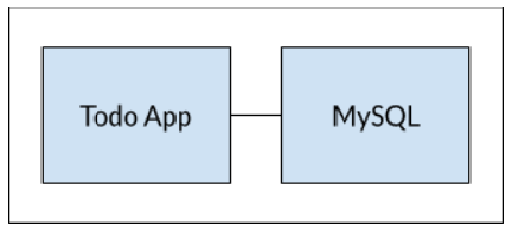

## Containerized applications with docker.

This is a TODO-list application that uses docker.

- We have the ToDo list application and a MySQL database to persist data.
- Multi-container managment with DockerSwarm.
- Bind Mount volumes and network configuration for communication between the containers.

### Architecture

[Click here for reference](https://docs.docker.com/get-started/02_our_app/)
